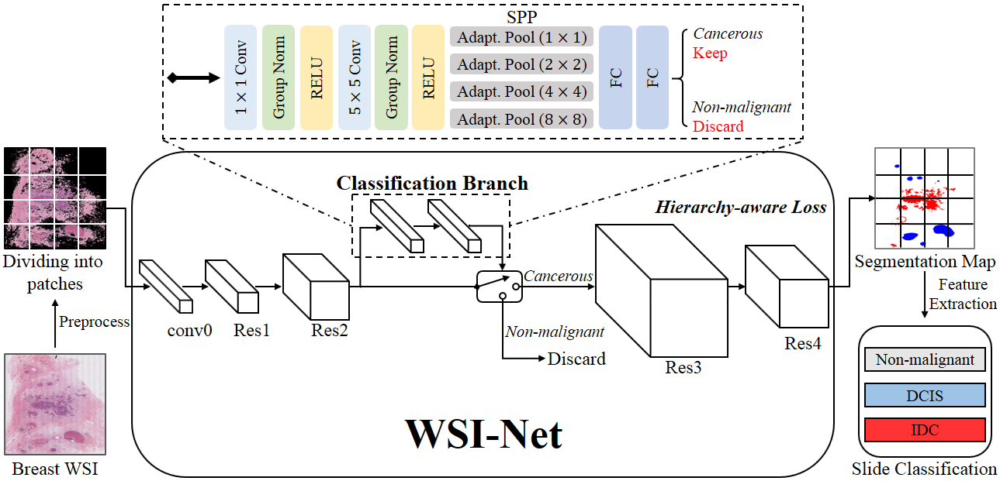

WSI-Net
====

The Pytorch implementation of our MLMI19 oral paper [WSI-Net: Branch-based and Hierarchy-aware Network for Segmentation and Classification of Breast Histopathological Whole-slide Images](https://drive.google.com/open?id=1XBRQUKKxkAYxywSY5EqqfSDaFTy9qvmr).

<div align=center></div>

Dependencies
----
Python 2.7, Pytorch 1.0.0, opencv, libtiff, tensorboardX, etc.

Data Preparation
----
Our benchmark dataset is provided by Xiangya Hospital, [Central South University](http://en.csu.edu.cn/index.htm), which is still a private dateset now. 
The detailed descrption of our dataset can be found in our paper. 
You may also utilize the other similar public datasets, 
such as [BACH](https://iciar2018-challenge.grand-challenge.org/), 
[Camelyon16](https://camelyon16.grand-challenge.org/) 
and [Camelyon17](https://camelyon17.grand-challenge.org/).

About Training
----
Our models mainly include: the original DeepLab, 
DeepLab-HA (DeepLab plus our hierarchy-aware loss), 
BranchNet (DeepLab plus our classification branch),
and WSI-Net (DeepLab-HA plus our classification branch).

### A. Training DeepLab
We borrow the code of DeepLab from this [link](https://github.com/speedinghzl/Pytorch-Deeplab).

For training DeepLab, we first utilize **XY3_Cut_1280_train_patch.py** to 
preprocess each whole-slide image (WSI) to remove non-tissue
areas and divide it into multiple training patches. This code will also generate the 
**train.txt** for training.

Subsequently, we train our baseline DeepLab model. The implementation details 
about this model can be found in **Pytorch-Deeplab/deeplab/model.py**.
Please run **Pytorch-Deeplab/train.py** to perform the training process.

### B. Training DeepLab-HA
DeepLab-HA is actually training DeepLab with traditional pixel-wise loss plus our
proposed hierarchy-aware loss. The training process is very similar to training DeepLab,
except running **Pytorch-Deeplab/train_plus_label_constraint.py** instead of train.py.

### C. Training BranchNet
BranchNet is DeepLab plus classification Branch.
The preprocessing and patch dividing is similar to part A and Part B. 

When training, we first train DeepLab for 1 epoch from pretrained model. Then we fix it
and only train our classification branch for 25 epochs. This process can be implemented by running 
**Pytorch-Deeplab/train_initial_check.py**. Note that when training branch part, we need the patch
with the size of 4096*4096. So please change the parameter setting in **XY3_Cut_1280_train_patch.py**
 to generate these patches. 
Subsequently, we later jointly train DeepLab and classification branch for 9 epochs by running 
**Pytorch-Deeplab/train_jointly_wo_patch_loss.py**.

### D. Training WSI-Net
WSI-Net is DeepLab-HA plus classification Branch. 
The training process is very similar to that of BranchNet, except training DeepLab-HA instead of
 DeepLab in the beginning, and finally run **Pytorch-Deeplab/train_jointly.py** to jointly
 train DeepLab-HA and branch. 

About Testing
----
The testing processes include dividing WSI testing patches, performing inference on each testing patches,
merging testing patches results into the single WSI segmentation results, and finally extracting
 feature from WSI and performing classification.
 
Firstly, please run **XY3_divide_test_patch.py** to divide WSI into testing patches.

Secondly, please run **Pytorch-Deeplab/evaluate.py** to perform inference using DeepLab or DeepLab-HA. 
please run **Pytorch-Deeplab/test_initial_check.py** to perform inference using BranchNet or WSI-Net.
You can use **SaveHeatmapAndMask.py** to visualize the patch segmentation results.

Thirdly, please run **merge_npz_final.py** to merge testing patches results into the single WSI segmentation results.
You can use **SaveWholeHeatmapAndMask.py** to visualize the WSI segmentation results.

Finally, please run **ExtraFeatureFromMap.py** to extract WSI feature and perform WSI segmentation. You can use 
**Metrics.py** or **Bootstrap_metrics.py** (used in our paper) for performance evaluation.

Supplementary
----
More details can also be found in our [supplementary file](https://drive.google.com/open?id=1Xb9mNkiJkLnMNhJDBlenbdK6aktH31cI).

Citing WSI-Net
----
If you find our approaches useful in your research, please consider citing:
```
@inproceedings{ni2019wsi,
  title={WSI-Net: Branch-Based and Hierarchy-Aware Network for Segmentation and Classification of Breast Histopathological Whole-Slide Images},
  author={Ni, Haomiao and Liu, Hong and Wang, Kuansong and Wang, Xiangdong and Zhou, Xunjian and Qian, Yueliang},
  booktitle={International Workshop on Machine Learning in Medical Imaging},
  pages={36--44},
  year={2019},
  organization={Springer}
}
```
For any problems with the code, please feel free to contact me: homerhm.ni@gmail.com

Acknowledgement
----
We acknowledge the code about DeepLab from [speedinghzl](https://github.com/speedinghzl/Pytorch-Deeplab).
